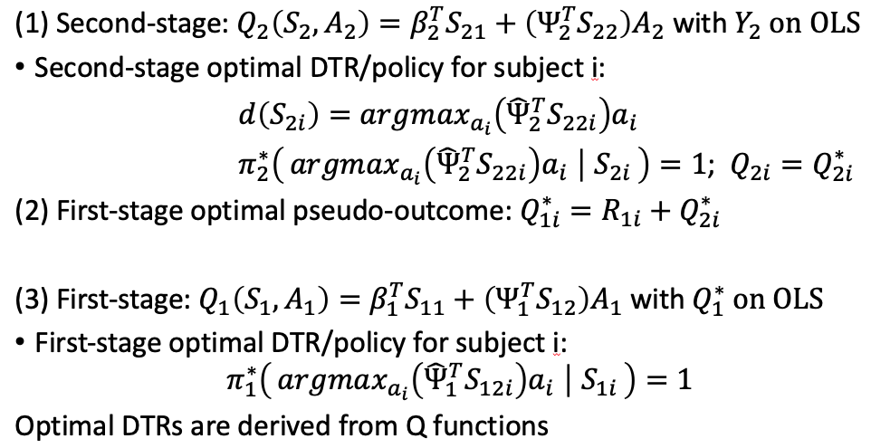
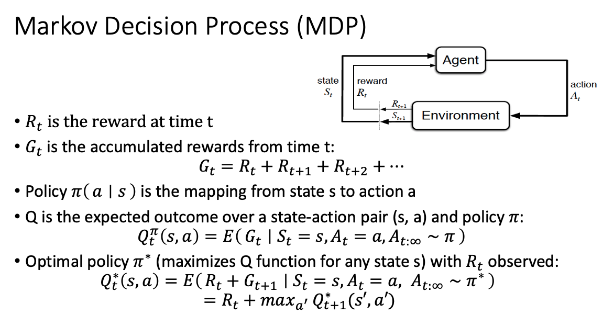
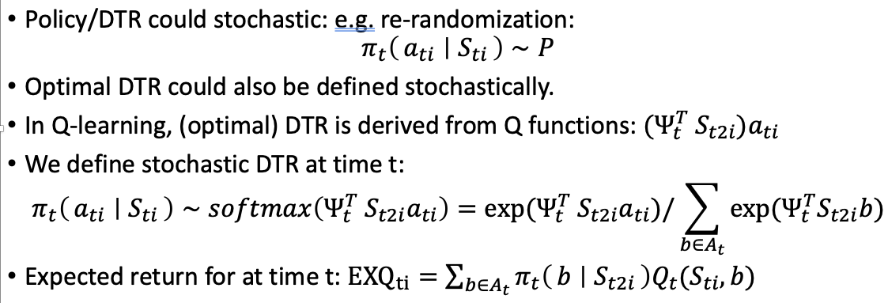
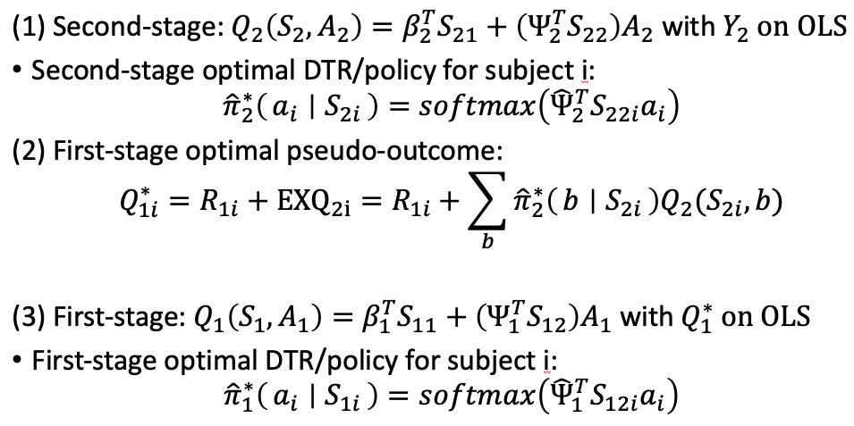
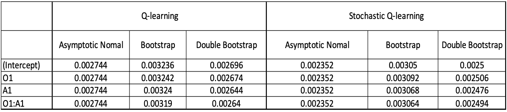

# Stochastic Q Learning: Estimation with Stochastic Policy/Dynamic Treatment Regimes for Reinforcement Learning
Hengshi Yu


## Q learning for a dynamic treatment regime (DTR)

Three steps in a two-stage dynamic treatment regime:
1. Step 1: Least square estimation (OLS) using second stage outcome
2. Step 2: Estimate first stage individual pseudo-outcome
3. Step 3: Least square estimation using first stage pseudo-outcome 




## Markov decision process and Q learning
Based on the Markov decision process, we have:  


The Q learning for DTR typically assumes a deterministic policy. We extend the deterministic DTR/policy to be a stochastic policy and we then have




## Stochastic Q Learning for DTR




## Run experiments
```
Rscript run.R
```

## Some Results
We have the average lengths of confidence intervals.

